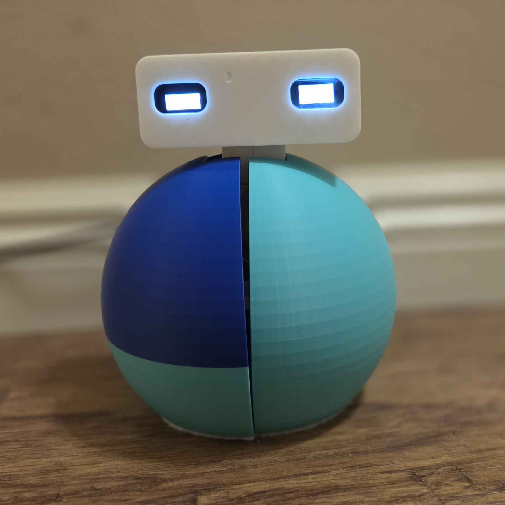

# Orbbit - Anxiety Reduction Robot 
This is currently in progress!

Summer Research Project recreating anxiety robot for low cost, open source use.
Read about my project in depth here: [Orbbit Paper]() 

## The inspiration: Ommie by Yale's Social Robotics Lab
[Ommie by Yale Researchers](https://scazlab.yale.edu/ommie-robot)
created a robot to guide deep breathing exercises. Focused breathing has been proven to be an effective tool to combat anxiety and improve your sense of calm. Ommie leads the exercise by mimicing breathing through expantion and contraction of its body, based on the idea that having a personified object to breathe with you will take advantage of human co-regulation and HRI effects to have consistent, deep breaths.

## About Orbbit

  

I was inspired by the research done at Yale's social robotics lab, showing how an anthropomorphic robot design can support anxiety reduction. I wanted to try this robot for myself to see if it could help manage my own stress. and create a version which is low cost and open source for others to try using too or build upon. When reading the paper, I had a few changes in mind to make it more appealing to people such as myself, such as changing the expantion/contraction to be horizontal instead of vertical to help me focus on breathing with my stomach versus my shoulders. 

## Bill of Materials

## Assembly Instructions
tba.
